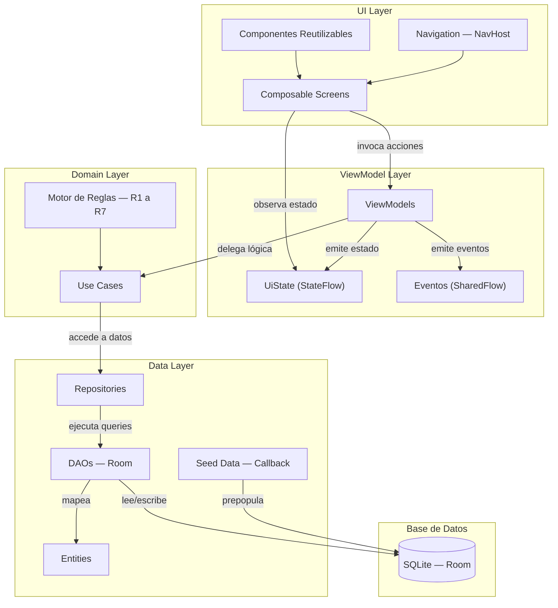
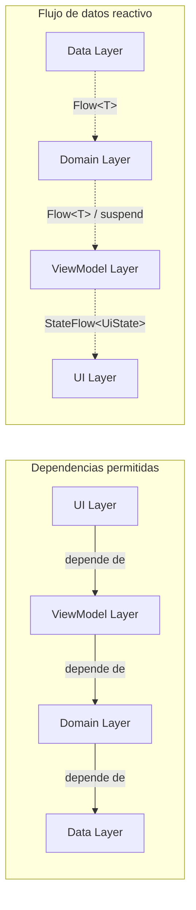
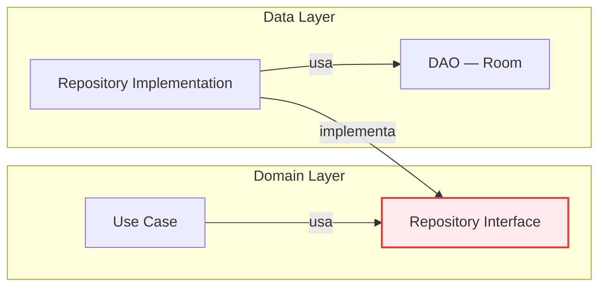
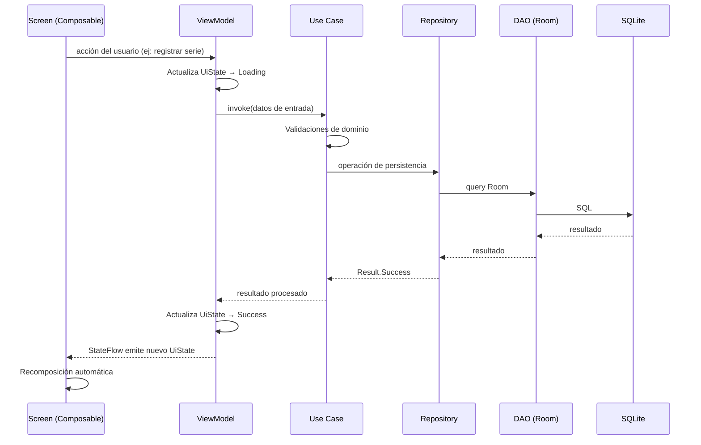
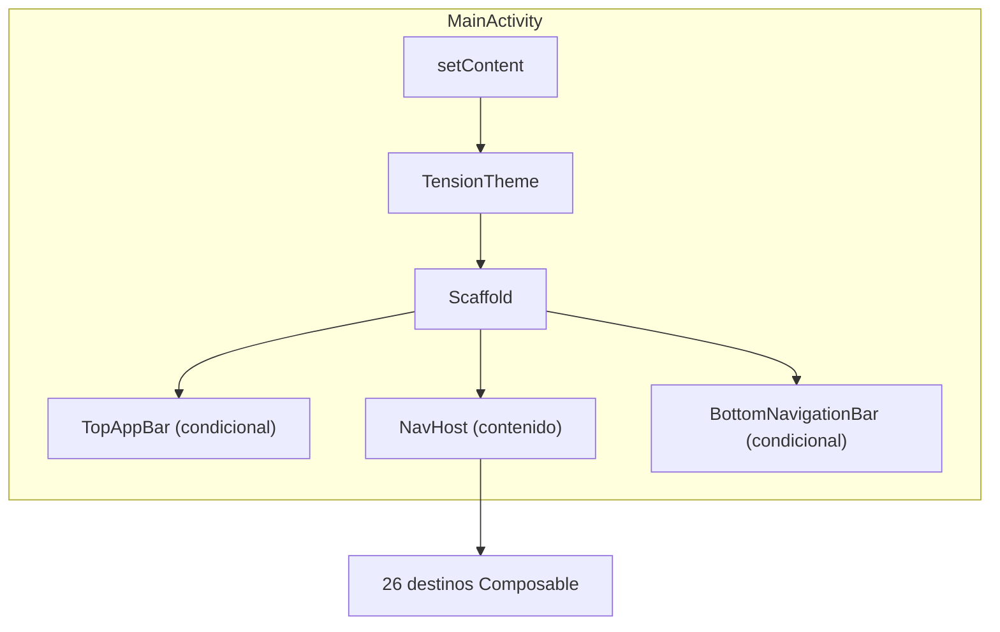
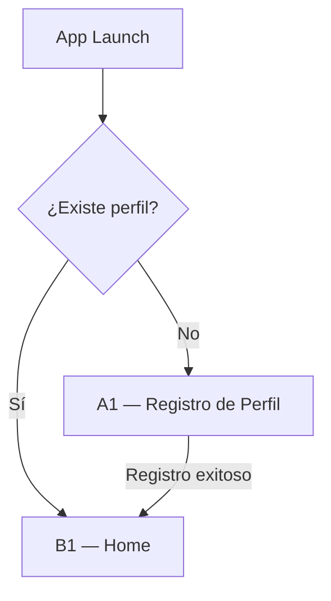

# Arquitectura Técnica — Tension

---

## 1. Stack Tecnológico

### 1.1. Plataforma y compilación

| Componente | Valor | RNF |
|------------|-------|-----|
| Lenguaje | Kotlin 2.0.21 | RNF33 |
| Android minSdk | 26 (Android 8.0) | RNF20 |
| Android targetSdk / compileSdk | 35 (Android 15) | — |
| JVM target | 11 | — |
| Build system | Gradle con Kotlin DSL (AGP 8.9.1) | RNF36 |
| Gestión de dependencias | Version Catalog (`libs.versions.toml`) | RNF36 |
| Distribución | APK firmado (instalación directa, sin Play Store) | RNF37 |

### 1.2. UI y presentación

| Librería | Rol | RNF |
|----------|-----|-----|
| Jetpack Compose (vía BOM) | Framework declarativo de UI. Reemplaza el sistema de vistas XML | RNF34 |
| Compose Material 3 | Implementación del sistema de diseño Material 3. Provee componentes (NavigationBar, TopAppBar, Card, Button, TextField, etc.), tema dinámico claro/oscuro y escala tipográfica | RNF23 |
| Compose UI Tooling | Previews de Composables en Android Studio | — |
| Material Symbols / Icons Extended | Íconos del sistema de diseño (Home, MenuBook, History, BarChart, Settings, etc.) | — |

### 1.3. Arquitectura y ciclo de vida

| Librería | Rol | RNF |
|----------|-----|-----|
| Lifecycle ViewModel Compose | Integración de `ViewModel` con Compose (`viewModel()`, `hiltViewModel()`) | RNF28 |
| Lifecycle Runtime Compose | `collectAsStateWithLifecycle()` para recolección lifecycle-aware de `StateFlow` | RNF28 |
| Kotlin Coroutines | Concurrencia estructurada para operaciones asíncronas (IO de base de datos, cálculos del motor de reglas) | RNF33 |
| Kotlin Flow / StateFlow | Streams reactivos para exponer estado del ViewModel a la UI y para queries reactivas de Room | RNF35 |

### 1.4. Navegación

| Librería | Rol | RNF |
|----------|-----|-----|
| Navigation Compose | Navegación declarativa en Compose. Single Activity + `NavHost` con rutas tipadas. Gestión del back stack, argumentos y deep links internos | RNF28 |

### 1.5. Persistencia

| Librería | Rol | RNF |
|----------|-----|-----|
| Room Runtime | ORM sobre SQLite. Mapea las 16 entidades del Modelo de Datos a `@Entity`, `@Dao`, `@Database` | RNF35 |
| Room KTX | Extensiones de coroutines para Room: queries suspendidas y `Flow<T>` reactivo | RNF35 |
| Room Compiler (KSP) | Procesador de anotaciones en tiempo de compilación. Genera implementaciones de DAOs y la base de datos | RNF35 |

### 1.6. Inyección de dependencias

| Librería | Rol | RNF |
|----------|-----|-----|
| Hilt Android | Framework de inyección de dependencias basado en Dagger. Gestiona el grafo de dependencias: `AppDatabase` → DAOs → Repositories → Use Cases → ViewModels | RNF32 |
| Hilt Navigation Compose | Integración de Hilt con Navigation Compose: `hiltViewModel()` scoped al destino de navegación | RNF32 |

### 1.7. Testing

| Librería | Rol | RNF |
|----------|-----|-----|
| JUnit 4 | Framework de tests unitarios para lógica de negocio y motor de reglas | RNF30 |
| Compose UI Test JUnit4 | Tests de UI instrumentados para pantallas Compose | — |
| Espresso Core | Tests de integración de Android | — |

### 1.8. Resumen de dependencias por capa

| Capa | Dependencias |
|------|-------------|
| **UI** (Composables, Screens) | Compose BOM, Material 3, Icons Extended, Navigation Compose, Lifecycle Runtime Compose |
| **ViewModel** | Lifecycle ViewModel Compose, Hilt Navigation Compose, Coroutines, Flow |
| **Domain** (Use Cases, Motor de Reglas) | Kotlin stdlib únicamente — sin dependencias de Android (RNF29) |
| **Data** (Repository, DAO, Entity) | Room Runtime, Room KTX, Coroutines |
| **DI** | Hilt Android, Hilt Navigation Compose |
| **Test** | JUnit 4, Compose UI Test, Espresso |

---

## 2. Arquitectura por Capas (MVVM)

### 2.1. Visión general

La aplicación sigue el patrón **MVVM (Model-View-ViewModel)** con una capa de dominio explícita que aísla la lógica de negocio del framework Android. La arquitectura se organiza en 4 capas con dependencias estrictamente unidireccionales: cada capa solo conoce a la capa inmediatamente inferior y nunca hacia arriba.



### 2.2. Regla de dependencia

```
UI → ViewModel → Domain → Data → Room/SQLite
```

- Cada capa solo depende de la capa inmediatamente inferior.
- Ninguna capa inferior referencia a una capa superior.
- La capa Domain **no tiene dependencias de Android** — es Kotlin puro (RNF29). Esto garantiza que el motor de reglas y los Use Cases son testeables con JUnit estándar sin emulador ni instrumentación.
- La comunicación de abajo hacia arriba se realiza mediante tipos reactivos: la Data Layer expone `Flow<T>`, que el ViewModel transforma en `StateFlow<UiState>`, que la UI recolecta con `collectAsStateWithLifecycle()`.



### 2.3. UI Layer (Composable Screens)

**Responsabilidad:** Renderizar la interfaz de usuario y capturar las interacciones del ejecutante. No contiene lógica de negocio ni acceso a datos.

| Aspecto | Detalle |
|---------|---------|
| Tecnología | Jetpack Compose + Material 3 |
| Composición | Cada vista del Mapa de Navegación (26 vistas: A1, B1, C1, etc.) es una función `@Composable` de nivel Screen |
| Estado | Recibe `UiState` como parámetro inmutable desde el ViewModel. No mantiene estado de negocio propio |
| Acciones | Delega las interacciones del usuario al ViewModel mediante lambdas o llamadas a funciones del ViewModel |
| Navegación | Gestionada por el `NavHost` central. Los Screens no navegan directamente — invocan callbacks que el nivel de navegación resuelve |
| Componentes reutilizables | Componentes compartidos entre múltiples Screens: Bottom Navigation Bar, Top App Bar, cards de ejercicio, indicadores de progresión, selector RIR, etc. |
| Tema | `TensionTheme` aplica la paleta de colores (claro/oscuro), tipografía y shapes definidos en la Especificación Visual |

**Lo que esta capa NO hace:**
- No accede a Room, DAOs ni Repositories.
- No ejecuta lógica de negocio (validaciones de dominio, cálculos de progresión, reglas de decisión).
- No gestiona coroutines de IO directamente.

### 2.4. ViewModel Layer

**Responsabilidad:** Gestionar el estado de la UI, exponer datos reactivos a los Composables, y orquestar operaciones delegando la lógica de negocio a los Use Cases.

| Aspecto | Detalle |
|---------|---------|
| Base class | `ViewModel()` estándar (no `AndroidViewModel`) — las dependencias llegan por inyección con Hilt (`@HiltViewModel`) |
| Estado de UI | Cada ViewModel expone un `StateFlow<UiState>` con una sealed class o data class que representa todos los estados posibles de la pantalla (Loading, Success, Error, Empty, etc.) |
| Eventos one-shot | Acciones que no son estado persistente (navegar a otra pantalla, mostrar snackbar, scroll) se emiten mediante `SharedFlow` o `Channel` para garantizar que se consumen exactamente una vez |
| Scope | `viewModelScope` para lanzar coroutines. Las operaciones de IO se delegan a los Use Cases que internamente usan `Dispatchers.IO` |
| Granularidad | Un ViewModel por Screen o por flujo funcional cohesivo. Screens simples de solo lectura (ej: D2 — Ficha de Ejercicio) pueden compartir ViewModel con su Screen padre si la complejidad es baja |

**Lo que esta capa NO hace:**
- No referencia clases de la UI (Composables, Context, Activity).
- No accede directamente a DAOs ni a Room — toda operación de datos pasa por Use Cases que a su vez usan Repositories.
- No implementa reglas de negocio del dominio (progresión, descarga, alertas) — las delega a los Use Cases.

### 2.5. Domain Layer (Use Cases + Motor de Reglas)

**Responsabilidad:** Encapsular la lógica de negocio del sistema. Es la capa más crítica del proyecto — contiene las reglas que transforman datos crudos en decisiones de entrenamiento. Es **100% Kotlin puro** sin ninguna dependencia del framework Android (RNF29).

| Aspecto | Detalle |
|---------|---------|
| Use Cases | Cada operación de negocio se modela como una clase con un único método público (`invoke` / `operator fun invoke`). Recibe datos, ejecuta lógica, retorna resultado. Se organizan por flujo de negocio (perfil, sesión, progresión, descarga, rotación, alertas, métricas, catálogo). Las clases concretas se definen en el refinamiento de cada HU. Flujos de catálogo incluyen: consulta con filtros, creación de ejercicios (RF62), asignación/desasignación a versiones del plan (RF63, RF64) |
| Motor de Reglas | Las Reglas 1-7 del MDS se implementan como funciones puras dentro de esta capa. Son invocadas por los Use Cases de cierre de sesión. Cada regla es una unidad testeable independiente |
| Dependencias | Solo depende de interfaces de Repository (definidas en esta misma capa). Las implementaciones concretas (Room) se inyectan en runtime por Hilt |
| Testing | Testeable con JUnit estándar sin emulador (RNF30). Los Repositories se mockean con interfaces. No requiere `Context`, `Application` ni ningún componente Android |

**Lo que esta capa NO hace:**
- No importa ninguna clase de `android.*`, `androidx.*` ni `com.google.*`.
- No accede directamente a Room ni a SQLite.
- No conoce Compose, ViewModels ni navegación.

### 2.6. Data Layer (Repository + DAO + Entity)

**Responsabilidad:** Persistir y recuperar datos de la base de datos local. Abstrae los detalles de Room detrás de interfaces de Repository que la capa Domain consume.

| Aspecto | Detalle |
|---------|---------|
| Repository | Cada Repository encapsula uno o más DAOs relacionados y expone operaciones de dominio. La interfaz se define en Domain; la implementación vive en Data. Esto invierte la dependencia: Domain no conoce Room |
| DAO | Interfaces `@Dao` de Room. Una por entidad o por grupo de entidades estrechamente relacionadas. Métodos suspendidos para escritura, `Flow<T>` para consultas reactivas |
| Entity | Data classes con `@Entity` que mapean 1:1 las 16 tablas del Modelo de Datos. Incluyen `@PrimaryKey`, `@ForeignKey`, `@ColumnInfo`, `@Index` |
| TypeConverters | Conversores para tipos no nativos de SQLite (ej: `String` ↔ `LocalDate` para fechas ISO 8601) |
| Seed Data | Prepopulación mediante `RoomDatabase.Callback.onCreate()`. Patrón Facade que delega en servicios temáticos (módulos, ejercicios, zonas musculares, plan de asignación) |
| AppDatabase | Singleton provisto por Hilt (`@Singleton`). Declara las 16 entidades, los TypeConverters y expone los DAOs |

**Patrón Repository — inversión de dependencia:**



La interfaz del Repository se define en Domain (Kotlin puro). La implementación concreta vive en Data y es inyectada por Hilt en runtime. Esto permite que los Use Cases se testeen con mocks sin necesidad de Room ni SQLite.

### 2.7. Flujo de datos completo — ejemplo: Registrar una serie



---

## 3. Estructura de Paquetes

### 3.1. Criterio de organización

La estructura de paquetes sigue un enfoque **híbrido capa-primero (layer-first) con agrupación por feature dentro de cada capa**. La raíz se organiza por las 4 capas de arquitectura (`ui`, `domain`, `data`, `di`), y dentro de las capas UI y Domain — que son las más extensas — se sub-agrupan por flujo funcional para mantener cohesión.

**¿Por qué layer-first y no feature-first?** En aplicaciones con Hilt y lógica de dominio densa, la separación por capas hace explícita la regla de dependencia (UI → ViewModel → Domain → Data). Los Use Cases y Repositories residen en paquetes que reflejan restricciones arquitectónicas, no agrupaciones temáticas arbitrarias. Dentro de cada capa, los features agrupan lo que cambia junto.

### 3.2. Árbol de paquetes

```text
com.estebancoloradogonzalez.tension/
│
├── ui/                                      ← UI Layer
│   ├── navigation/                          ← NavHost, definición de rutas, ítems del Bottom Nav
│   ├── components/                          ← Composables reutilizables cross-feature
│   ├── theme/                               ← Color, Theme, Type (Especificación Visual)
│   ├── onboarding/                          ← Flujo A — Onboarding (A1)
│   ├── home/                                ← Flujo B — Inicio (B1)
│   ├── profile/                             ← Flujo C — Perfil del Ejecutante (C1, C2)
│   ├── catalog/                             ← Flujo D — Catálogo: Diccionario y Plan (D1, D2, D3, D4)
│   ├── session/                             ← Flujo E — Sesión Activa (E1, E2, E3, E4, E5)
│   ├── history/                             ← Flujo F — Historial (F1, F2, F3)
│   ├── metrics/                             ← Flujo G — Métricas y KPIs (G1, G2, G3)
│   ├── alerts/                              ← Flujo H — Alertas (H1, H2)
│   ├── deload/                              ← Flujo I — Gestión de Descarga (I1)
│   └── settings/                            ← Flujo J — Configuración y Respaldo (J1, J2, J3)
│
├── domain/                                  ← Domain Layer (Kotlin puro — sin Android)
│   ├── model/                               ← Enums y modelos de dominio (no son entities de Room)
│   ├── repository/                          ← Interfaces de Repository (contratos)
│   ├── usecase/                             ← Use Cases organizados por flujo de negocio
│   └── rules/                               ← Motor de Reglas (R1-R7 del MDS) — funciones puras
│
├── data/                                    ← Data Layer
│   ├── local/
│   │   ├── database/                        ← TensionDatabase, TypeConverters
│   │   ├── dao/                             ← DAOs de Room (interfaces @Dao)
│   │   ├── entity/                          ← Entities de Room (16 entidades del Modelo de Datos)
│   │   ├── seed/                            ← Seed data (PrepopulateCallback, PrepopulateFacade, Seeders)
│   │   └── storage/                         ← ImageStorageHelper (copia/eliminación de imágenes en almacenamiento interno)
│   └── repository/                          ← Implementaciones concretas de las interfaces de Repository
│
└── di/                                      ← Módulos Hilt de Inyección de Dependencias
```

Cada paquete de feature dentro de `ui/` contiene sus Screens (`@Composable`) y ViewModels (`@HiltViewModel`). Las clases concretas, su cantidad y granularidad se definen en el refinamiento de cada historia de usuario.

### 3.3. Mapeo Vista → Paquete

| Flujo | Vistas | Paquete UI |
|-------|--------|------------|
| A — Onboarding | A1 | `ui.onboarding` |
| B — Inicio | B1 | `ui.home` |
| C — Perfil | C1, C2 | `ui.profile` |
| D — Catálogo | D1, D2, D3, D4, D5 | `ui.catalog` |
| E — Sesión Activa | E1, E2, E3, E4, E5 | `ui.session` |
| F — Historial | F1, F2, F3 | `ui.history` |
| G — Métricas | G1, G2, G3 | `ui.metrics` |
| H — Alertas | H1, H2 | `ui.alerts` |
| I — Descarga | I1 | `ui.deload` |
| J — Configuración | J1, J2, J3 | `ui.settings` |

**Total:** 26 Screens distribuidos en 10 paquetes de feature + 3 paquetes transversales (`navigation`, `components`, `theme`).

---

## 4. Navegación (Single Activity + Compose NavHost)

### 4.1. Patrón Single Activity

La aplicación tiene una única `Activity` (`MainActivity`) que actúa como contenedor. Dentro de ella, `setContent` monta el árbol Compose con el tema, la estructura de Scaffold (Top Bar + Bottom Nav + contenido) y el `NavHost` que gestiona todas las transiciones entre las 26 vistas.



### 4.2. Start destination dinámica

Al iniciar la app, se determina si el ejecutante ya tiene perfil registrado. Esto define la primera pantalla que se muestra:

- **Sin perfil** → `A1` (Registro de Perfil). Flujo obligatorio de onboarding.
- **Con perfil** → `B1` (Home). Pantalla principal recurrente.

Esta decisión se toma una sola vez al cargar el `NavHost`. El ViewModel raíz consulta si existe un registro en la tabla `profile` y expone el resultado como estado. El `NavHost` usa ese estado para establecer el `startDestination` antes de renderizar.



### 4.3. Inventario de rutas

Las 26 vistas se organizan en rutas dentro del `NavHost`. Cada ruta tiene un identificador string, los argumentos necesarios y la vista destino.

| # | Vista | Ruta | Argumentos | Paquete UI |
|---|-------|------|------------|------------|
| 1 | A1 — Registro de Perfil | `register` | — | `ui.onboarding` |
| 2 | B1 — Home | `home` | — | `ui.home` |
| 3 | C1 — Perfil del Ejecutante | `profile` | — | `ui.profile` |
| 4 | C2 — Historial de Peso | `weight-history` | — | `ui.profile` |
| 5 | D1 — Diccionario de Ejercicios | `exercise-dictionary` | — | `ui.catalog` |
| 6 | D2 — Detalle de Ejercicio | `exercise-detail/{exerciseId}` | `exerciseId: Long` | `ui.catalog` |
| 7 | D3 — Plan de Entrenamiento | `training-plan` | — | `ui.catalog` |
| 8 | D4 — Detalle de Versión del Plan | `plan-version-detail/{moduleVersionId}` | `moduleVersionId: Long` | `ui.catalog` |
| 8b | D5 — Crear Ejercicio | `create-exercise` | — | `ui.catalog` |
| 9 | E1 — Sesión Activa | `active-session/{sessionId}` | `sessionId: Long` | `ui.session` |
| 10 | E2 — Registro de Serie | `register-set/{sessionExerciseId}` | `sessionExerciseId: Long` | `ui.session` |
| 11 | E3 — Selección Sustituto | `substitute-exercise/{sessionExerciseId}` | `sessionExerciseId: Long` | `ui.session` |
| 12 | E4 — Confirmación de Cierre | Diálogo superpuesto sobre E1 | — (no es ruta, es dialog) | `ui.session` |
| 13 | E5 — Resumen Post-Sesión | `session-summary/{sessionId}` | `sessionId: Long` | `ui.session` |
| 14 | F1 — Historial de Sesiones | `session-history` | — | `ui.history` |
| 15 | F2 — Detalle de Sesión Pasada | `session-detail/{sessionId}` | `sessionId: Long` | `ui.history` |
| 16 | F3 — Historial de Ejercicio | `exercise-history/{exerciseId}` | `exerciseId: Long` | `ui.history` |
| 17 | G1 — Panel de Métricas | `metrics` | — | `ui.metrics` |
| 18 | G2 — Volumen por Grupo Muscular | `muscle-volume` | — | `ui.metrics` |
| 19 | G3 — Tendencia de Progresión | `progression-trend` | — | `ui.metrics` |
| 20 | H1 — Centro de Alertas | `alert-center` | — | `ui.alerts` |
| 21 | H2 — Detalle de Alerta | `alert-detail/{alertId}` | `alertId: Long` | `ui.alerts` |
| 22 | I1 — Gestión de Descarga | `deload` | — | `ui.deload` |
| 23 | J1 — Configuración | `settings` | — | `ui.settings` |
| 24 | J2 — Exportar Respaldo | `export-backup` | — | `ui.settings` |
| 25 | J3 — Importar Respaldo | `import-backup` | — | `ui.settings` |

**Convenciones de rutas:**

- Kebab-case (`exercise-detail`, `session-history`).
- Argumentos embebidos en la ruta con `{paramName}` y tipo `Long` para IDs de entidad.
- E4 no es una ruta de navegación — es un `AlertDialog` Compose como diálogo superpuesto sobre E1, gestionado por el estado del ViewModel.

### 4.4. Nested Navigation Graphs

Para organizar las rutas y gestionar correctamente el back stack, el `NavHost` se estructura en sub-grafos anidados por flujo funcional:

```mermaid
graph TD
    subgraph "NavHost (raíz)"
        direction TB
        ROOT["startDestination dinámica"]

        subgraph "onboarding-graph"
            A1["register"]
        end

        subgraph "home-graph"
            B1["home"]
        end

        subgraph "profile-graph"
            C1["profile"] --> C2["weight-history"]
        end

        subgraph "catalog-graph"
            D1["exercise-dictionary"] --> D2["exercise-detail/{id}"]
            D1 --> D5["create-exercise"]
            D3["training-plan"] --> D4["plan-version-detail/{id}"]
            D4 --> D2b["exercise-detail/{id}"]
        end

        subgraph "session-graph"
            E1["active-session/{id}"] --> E2["register-set/{id}"]
            E1 --> E3["substitute-exercise/{id}"]
            E1 --> E5["session-summary/{id}"]
        end

        subgraph "history-graph"
            F1["session-history"] --> F2["session-detail/{id}"]
            F2 --> F3["exercise-history/{id}"]
        end

        subgraph "metrics-graph"
            G1["metrics"] --> G2["muscle-volume"]
            G1 --> G3["progression-trend"]
        end

        subgraph "alerts-graph"
            H1["alert-center"] --> H2["alert-detail/{id}"]
        end

        subgraph "deload-graph"
            I1["deload"]
        end

        subgraph "settings-graph"
            J1["settings"] --> J2["export-backup"]
            J1 --> J3["import-backup"]
            J1 --> C1b["profile"]
        end
    end
```



Cada sub-grafo tiene su propia start destination. Los nested graphs aíslan el back stack: al navegar con el Bottom Nav hacia otro tab, el estado de cada sub-grafo se preserva (el ejecutante retorna donde estaba). Esto coincide con el comportamiento estándar de `NavigationBar` + `NavHost` en Compose.

### 4.5. Bottom Navigation Bar

El Bottom Navigation conecta las 5 secciones principales de la app. Cada ítem apunta al start destination de su nested graph.

| # | Ítem | Ícono (Material Symbols) | Destino raíz | Nested graph |
|---|------|--------------------------|-------------|-------------|
| 1 | Inicio | `Home` | `home` (B1) | `home-graph` |
| 2 | Diccionario | `MenuBook` | `exercise-dictionary` (D1) | `catalog-graph` |
| 3 | Historial | `History` | `session-history` (F1) | `history-graph` |
| 4 | Métricas | `BarChart` | `metrics` (G1) | `metrics-graph` |
| 5 | Configuración | `Settings` | `settings` (J1) | `settings-graph` |

#### 4.5.1. Reglas de visibilidad

La Bottom Navigation Bar **no se muestra en todas las pantallas**. Las reglas son:

| Regla | Vistas afectadas | Motivo |
|-------|-----------------|--------|
| **Siempre oculta** | A1 | Onboarding — aún no hay acceso al sistema |
| **Siempre oculta** | E1, E2, E3, E4, E5 | Sesión activa — el ejecutante está contenido en el flujo de sesión para evitar abandono accidental |
| **Condicional** | D2 | **Visible** si el origen es D1, D4 o F3. **Oculta** si el origen es E1 (sesión activa) |
| **Condicional** | F3 | **Visible** si el origen es F2, G1, H2 o D2. **Oculta** si el origen es E5 (post-sesión) |
| **Siempre visible** | Todas las demás (B1, C1, C2, D1, D3, D4, F1, F2, G1, G2, G3, H1, H2, I1, J1, J2, J3) | Navegación global activa |

La visibilidad se determina evaluando la ruta actual del `NavController`. Para los casos condicionales (D2, F3), se pasa el origen como argumento adicional o se evalúa la entry anterior en el back stack.

### 4.6. Top App Bar

La Top App Bar varía según el contexto de la pantalla. Las variantes definidas en la Especificación Visual son:

| Variante | Vistas | Comportamiento |
|----------|--------|---------------|
| Center Aligned (sin retorno) | B1, D1/D3, F1, G1, J1 | Título centrado. Sin ícono de retorno. Vistas raíz de tab |
| Center Aligned (con retorno) | C1, C2, D2, D4, F2, F3, G2, G3, H1, H2, I1, J2, J3 | Título centrado + ícono `←` a la izquierda |
| Center Aligned (con cierre) | E2, E3 | Título centrado + ícono `✕` a la izquierda |
| Sin estilo estándar | A1 | Logo "Tension" centrado + subtítulo. Sin ícono. Sin Bottom Nav |
| Sesión Activa | E1 | Título izquierda (Módulo — Versión) + subtítulo "Sesión activa" + badge descarga condicional. Sin Bottom Nav |
| Post-Sesión | E5 | Título centrado + subtítulo módulo/versión. Sin ícono de retorno. Sin Bottom Nav |

### 4.7. Vistas reutilizables con contexto de origen

Dos vistas se acceden desde múltiples orígenes y adaptan su comportamiento de retorno y visibilidad del Bottom Nav según el contexto:

**D2 — Detalle de Ejercicio:**

| Origen | Retorno (botón atrás) | Bottom Nav |
|--------|----------------------|------------|
| D1 (Diccionario) | → D1 | Visible |
| D4 (Detalle Versión Plan) | → D4 | Visible |
| E1 (Sesión Activa) | → E1 | Oculta |
| F3 (Historial de Ejercicio) | → F3 | Visible |

**F3 — Historial de Ejercicio:**

| Origen | Retorno (botón atrás) | Bottom Nav |
|--------|----------------------|------------|
| F2 (Detalle de Sesión) | → F2 | Visible |
| E5 (Resumen Post-Sesión) | → E5 | Oculta |
| G1 (Panel de Métricas) | → G1 | Visible |
| H2 (Detalle de Alerta) | → H2 | Visible |
| D2 (Detalle de Ejercicio) | → D2 | Visible |

El manejo del retorno se resuelve naturalmente por el back stack de Navigation Compose: al hacer `popBackStack()`, el NavController retorna al destino anterior sin importar el origen. La visibilidad del Bottom Nav se resuelve evaluando si la entry anterior en el back stack pertenece al `session-graph`.

### 4.8. Transiciones especiales

| Transición | Tipo | Descripción |
|-----------|------|-------------|
| A1 → B1 | Única, sin retorno | Al completar onboarding, se navega a B1 limpiando el back stack (`popUpTo(register) { inclusive = true }`). El ejecutante no puede retroceder a A1 |
| E4 → E5 | Automática, sin retorno a E1 | Al confirmar cierre de sesión, el back stack se limpia hasta B1 (`popUpTo(home)`). E5 se monta sobre B1 — el ejecutante solo puede avanzar a B1 o F3 |
| E5 → B1 | Limpiar back stack de sesión | Al tocar "Ir al inicio", se navega a B1 con `popUpTo(home) { inclusive = true }` seguido de `navigate(home)` para resetear el grafo home |
| J3 → B1 | Reinicio post-importación | Tras importación exitosa, se navega a B1 limpiando todo el back stack. Equivale a un "reinicio lógico" de la app con los datos restaurados |
| Tabs D1 ↔ D3 | Lateral, sin apilamiento | El cambio entre tabs del Diccionario no apila entradas en el back stack. Se usa `launchSingleTop = true` y `restoreState = true` |
| Bottom Nav entre tabs | Preservar estado por tab | Cada tab guarda su estado interno. Al retornar a un tab, el ejecutante encuentra la pantalla donde la dejó. Implementado con `saveState = true` y `restoreState = true` en `navigate()` |

### 4.9. Diagrama de conexiones de navegación

El Mapa de Navegación documenta **58 conexiones** entre las 26 vistas. El diagrama completo de navegación con estilos por flujo, flechas de avance (sólidas) y retorno (punteadas) se encuentra en la sección 8 del [Mapa de Navegación](Mapa%20de%20Navegación.md). No se duplica aquí para evitar divergencia — este documento define la implementación técnica (rutas, nested graphs, back stack) y aquel define las relaciones funcionales.

---

## 5. Convenciones y Estándares de Código

### 5.1. Idioma

| Elemento | Idioma | Ejemplo |
|----------|--------|---------|
| Código fuente (clases, funciones, variables, paquetes) | Inglés | `ActiveSessionScreen`, `registerSet()`, `exerciseId` |
| Comentarios y documentación en código (KDoc) | Inglés | `/** Calculates the prescribed load ... */` |
| Datos de dominio y seed data (valores almacenados en BD) | Español | `"Sentadilla Búlgara"`, `"Kilogramo"`, `"Pecho"` |
| Strings visibles al usuario (UI) | Español | `"Iniciar sesión"`, `"Ingrese un valor válido"` |
| Nombres de rutas de navegación | Inglés (kebab-case) | `exercise-detail`, `session-history` |
| Documentación del proyecto (Markdown) | Español | Archivos en `docs/` |

### 5.2. Naming

#### Paquetes

- Minúsculas, una sola palabra cuando sea posible.
- Sin guiones bajos ni camelCase.
- Ejemplo: `ui.session`, `domain.usecase`, `data.local.dao`.

#### Clases y objetos

| Tipo | Convención | Ejemplo |
|------|-----------|---------|
| Screen (Composable de nivel pantalla) | `{Feature}Screen` | `HomeScreen`, `RegisterSetScreen` |
| ViewModel | `{Feature}ViewModel` | `HomeViewModel`, `ActiveSessionViewModel` |
| Use Case | `{Acción}{Entidad}UseCase` | `RegisterSetUseCase`, `DetectPlateauUseCase` |
| Repository (interfaz) | `{Entidad}Repository` | `SessionRepository`, `AlertRepository` |
| Repository (implementación) | `{Entidad}RepositoryImpl` | `SessionRepositoryImpl` |
| Entity (Room) | `{Entidad}Entity` | `SessionEntity`, `ExerciseSetEntity` |
| DAO | `{Entidad}Dao` | `SessionDao`, `ExerciseSetDao` |
| UiState | `{Feature}UiState` | `HomeUiState`, `ActiveSessionUiState` |
| Componente reutilizable | Nombre descriptivo sin sufijo forzado | `ProgressionIndicator`, `RirSelector` |
| Módulo Hilt | `{Ámbito}Module` | `DatabaseModule`, `RepositoryModule` |
| Regla del motor | `{Nombre}Rule` | `DoubleThresholdRule`, `PlateauDetectionRule` |
| Seeder (prepopulación) | `{Entidad}Seeder` | `ExerciseSeeder`, `ModuleSeeder` |
| TypeConverter | `Converters` (singular por archivo) | `Converters` |

#### Funciones

| Tipo | Convención | Ejemplo |
|------|-----------|---------|
| Composable de pantalla | `PascalCase` (estándar Compose) | `ActiveSessionScreen()` |
| Composable de componente | `PascalCase` | `ProgressionIndicator()` |
| Use Case invocable | `operator fun invoke()` | `operator fun invoke(sessionId: Long): Flow<Session>` |
| Funciones de ViewModel | `camelCase`, verbo en imperativo | `startSession()`, `registerSet()`, `closeSession()` |
| Funciones de DAO | `camelCase`, prefijo por operación | `insert()`, `getById()`, `getAllByModule()`, `updateStatus()`, `deleteById()` |
| Funciones suspend | Marcadas con `suspend` — no usar sufijo "Async" | `suspend fun getById(id: Long): Entity?` |
| Callbacks/lambdas en Composables | Prefijo `on` | `onStartSession`, `onRegisterSet`, `onNavigateBack` |

#### Variables y propiedades

| Tipo | Convención | Ejemplo |
|------|-----------|---------|
| StateFlow interno (ViewModel) | Prefijo `_`, tipo `MutableStateFlow` | `private val _uiState = MutableStateFlow(UiState())` |
| StateFlow expuesto (ViewModel) | Sin prefijo, tipo `StateFlow` | `val uiState: StateFlow<UiState> = _uiState.asStateFlow()` |
| SharedFlow para eventos | Prefijo `_` interno, tipo `SharedFlow` expuesto | `val events: SharedFlow<Event>` |
| Argumentos de navegación | camelCase | `exerciseId`, `sessionId`, `moduleVersionId` |
| Constantes | `SCREAMING_SNAKE_CASE` dentro de `companion object` u `object` | `MAX_SETS = 4`, `RIR_RANGE = 0..5` |
| Parámetros de Composable | camelCase, descriptivos | `exerciseName: String`, `isLoading: Boolean`, `onConfirm: () -> Unit` |

### 5.3. Estructura de Composables

Cada Screen Composable sigue una estructura consistente:

```kotlin
@Composable
fun FeatureScreen(
    viewModel: FeatureViewModel = hiltViewModel(),
    onNavigateToX: () -> Unit,
    onNavigateBack: () -> Unit
) {
    val uiState by viewModel.uiState.collectAsStateWithLifecycle()

    // Manejo de eventos one-shot (navegación, snackbar)
    LaunchedEffect(Unit) {
        viewModel.events.collect { event ->
            when (event) { /* ... */ }
        }
    }

    // Contenido según estado
    when (val state = uiState) {
        is Loading -> LoadingIndicator()
        is Success -> FeatureContent(state.data, onAction = viewModel::onAction)
        is Error -> ErrorMessage(state.message)
    }
}
```

**Principios:**

- El ViewModel se obtiene con `hiltViewModel()` — nunca se instancia manualmente.
- Las lambdas de navegación (`onNavigateToX`, `onNavigateBack`) se reciben como parámetros — el Screen no conoce el `NavController`.
- El estado se recolecta con `collectAsStateWithLifecycle()` para respetar el ciclo de vida.
- El contenido visual se extrae a una función `@Composable` interna (`FeatureContent`) que recibe datos inmutables y lambdas de acción. Esto facilita previews y testing.

### 5.4. Estructura de ViewModels

```kotlin
@HiltViewModel
class FeatureViewModel @Inject constructor(
    private val someUseCase: SomeUseCase
) : ViewModel() {

    private val _uiState = MutableStateFlow<FeatureUiState>(FeatureUiState.Loading)
    val uiState: StateFlow<FeatureUiState> = _uiState.asStateFlow()

    private val _events = MutableSharedFlow<FeatureEvent>()
    val events: SharedFlow<FeatureEvent> = _events.asSharedFlow()

    init {
        loadInitialData()
    }

    fun onAction(action: FeatureAction) {
        viewModelScope.launch {
            // Delegar al Use Case correspondiente
        }
    }
}
```

**Principios:**

- `@HiltViewModel` + `@Inject constructor` — las dependencias se inyectan automáticamente.
- Estado como `MutableStateFlow` privado, expuesto como `StateFlow` inmutable.
- Eventos one-shot como `MutableSharedFlow` privado, expuesto como `SharedFlow`.
- Las operaciones de IO se lanzan en `viewModelScope` — el Use Case maneja internamente el dispatcher.
- No se referencia `Context`, `Activity` ni ninguna clase de la UI.

### 5.5. Coroutines y threading

| Regla | Detalle |
|-------|---------|
| Scope de ViewModel | Toda coroutine del ViewModel se lanza en `viewModelScope` — se cancela automáticamente al destruirse |
| Dispatcher de IO | Los Repositories y DAOs ejecutan operaciones de base de datos en `Dispatchers.IO`. El ViewModel no selecciona dispatcher explícitamente — confía en que la capa inferior lo maneja |
| Main safety | Las funciones suspend de los Use Cases y Repositories son main-safe: internamente usan `withContext(Dispatchers.IO)` cuando acceden a Room |
| Paralelismo | Si un ViewModel necesita múltiples operaciones independientes, usa `async { }` + `awaitAll()` dentro de `viewModelScope.launch` |
| Flow collection | Los Composables recolectan `StateFlow` con `collectAsStateWithLifecycle()`. Los ViewModels pueden combinar múltiples Flows con `combine()` o `flatMapLatest()` |
| Cancelación estructurada | No se usan `GlobalScope` ni `CoroutineScope` manuales. Toda coroutine pertenece a un scope con lifecycle definido |

### 5.6. Manejo de errores

| Capa | Estrategia |
|------|-----------|
| **DAO** | Room lanza excepciones estándar de SQLite. No se capturan aquí — se propagan al Repository |
| **Repository** | Captura excepciones de IO y las transforma en tipos de resultado sellados (`Result<T>` o tipo propio `Success/Error`). No lanza excepciones al Use Case |
| **Use Case** | Recibe `Result<T>` del Repository. Aplica lógica de negocio y retorna `Result<T>` al ViewModel. Las validaciones de dominio producen `Result.Error` con mensaje descriptivo |
| **ViewModel** | Mapea `Result<T>` a estados de UI (`UiState.Error(message)`). Nunca lanza excepciones no capturadas — todo error se refleja como estado observable |
| **UI** | Renderiza el estado de error según el `UiState`. Muestra mensajes al usuario mediante Snackbar o `ErrorMessage` component. No tiene lógica de retry — delega al ViewModel si es necesario |

### 5.7. Strings y recursos

| Tipo | Ubicación | Ejemplo |
|------|-----------|---------|
| Textos visibles al usuario | `res/values/strings.xml` (español) | `<string name="start_session">Iniciar sesión</string>` |
| Mensajes de error de UI | `res/values/strings.xml` | `<string name="error_invalid_weight">Ingrese un peso válido</string>` |
| Mensajes de validación de dominio | Constantes en la capa Domain (Kotlin puro) | `"Weight must be >= 0"` (inglés, uso interno — no visible al usuario) |
| Nombres de tabla/columna Room | Constantes en companion objects de cada Entity o en un object dedicado | `const val TABLE_NAME = "session"` |
| Datos de seed | En código dentro de los Seeders | Valores en español: `"Sentadilla Búlgara"`, `"Pecho"` |

### 5.8. Formato y estilo de código

| Aspecto | Estándar |
|---------|---------|
| Formato | Kotlin Official Style Guide + ktlint |
| Indentación | 4 espacios |
| Longitud máxima de línea | 120 caracteres |
| Imports | Sin wildcards (`*`). Ordenados automáticamente por ktlint |
| Trailing commas | Habilitadas — cada parámetro o elemento de lista en su propia línea si hay más de 2 |
| Llaves | Estilo K&R (apertura en la misma línea) |
| Expresiones `when` | Preferidas sobre cadenas `if-else` cuando hay 3+ ramas |
| Null safety | Uso extensivo de `?.`, `?:`, `let`, `require`, `checkNotNull`. Evitar `!!` — solo permitido en tests |
| Data classes | Preferidas para todos los modelos de datos, DTOs, UiState y entities |
| Sealed classes/interfaces | Para representar estados finitos: `UiState`, `Event`, `Result`, `Action` |
