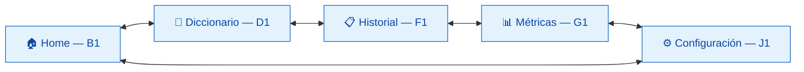
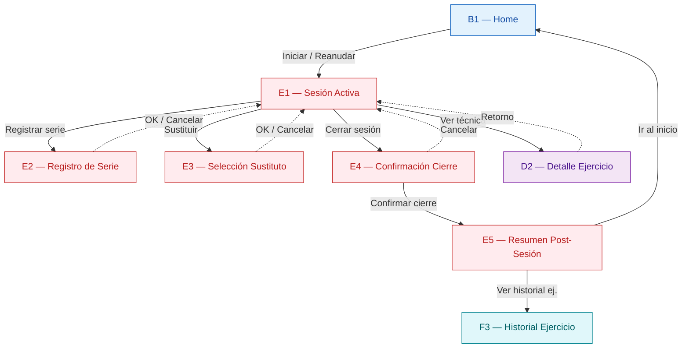

# Mapa de Navegación y Definición de Vistas — Tension

---

## 1. Propósito

Este documento define todas las vistas (pantallas) de la aplicación Tension, cómo se relacionan entre sí y el flujo de navegación completo del ejecutante. Sirve como punto de entrada para:

- Diseño de mockups de baja y alta fidelidad.
- Definición del diagrama de Fragments y Activity (Single Main Activity).
- Implementación de la navegación en código.

Cada vista está vinculada a las historias de usuario (HU) que respaldan su existencia, garantizando trazabilidad entre la definición funcional y la interfaz.

---

## 2. Convenciones

- **ID de vista:** Letra del flujo + número secuencial (ej: E1, E2).
- **HU directas:** Historias cuyo propósito principal se manifiesta en esa vista.
- **HU indirectas:** Historias cuyo output computacional se _muestra_ en esa vista, aunque el cálculo ocurra en el motor de reglas sin intervención del usuario.

---

## 3. Inventario de Vistas

### Flujo A — Onboarding

| ID | Vista | Propósito | HU Directas | HU Indirectas |
|----|-------|-----------|-------------|---------------|
| A1 | Registro de Perfil | Capturar peso corporal (Kg), altura (m) y nivel de experiencia (principiante, intermedio, avanzado) cuando el ejecutante usa la app por primera vez. Es la puerta de entrada obligatoria antes de acceder al sistema. Muestra teclado numérico para campos numéricos y valida rangos antes de permitir el registro. | HU-01 | — |

### Flujo B — Inicio

| ID | Vista | Propósito | HU Directas | HU Indirectas |
|----|-------|-----------|-------------|---------------|
| B1 | Pantalla Principal (Home) | Punto de entrada recurrente del ejecutante tras el onboarding. Muestra: qué módulo y versión toca a continuación según la rotación cíclica, conteo de microciclos completados, badge o indicador con el número de alertas activas, y acceso rápido a iniciar sesión. Si existe una sesión activa no cerrada (por cierre inesperado de la app), muestra prominentemente la opción de reanudarla. Ofrece navegación a las secciones principales del sistema. | HU-05, HU-18 | HU-14, HU-16, HU-17, HU-26, HU-27, HU-28, HU-29, HU-30 |

### Flujo C — Perfil del Ejecutante

| ID | Vista | Propósito | HU Directas | HU Indirectas |
|----|-------|-----------|-------------|---------------|
| C1 | Perfil del Ejecutante | Visualizar los datos actuales del perfil (peso, altura, nivel de experiencia) y permitir su edición. Teclado numérico para campos numéricos. Validación de rangos. Al actualizar peso, el cambio se registra automáticamente en el historial. Punto de acceso al Historial de Peso. | HU-01 | HU-02 |
| C2 | Historial de Peso Corporal | Mostrar todas las entradas del historial de peso corporal, cada una con fecha y valor en Kg, ordenadas cronológicamente de la más reciente a la más antigua. Permite visualizar la evolución temporal del peso. | HU-02 | — |

### Flujo D — Catálogo (Diccionario y Plan)

| ID | Vista | Propósito | HU Directas | HU Indirectas |
|----|-------|-----------|-------------|---------------|
| D1 | Diccionario de Ejercicios | Listado de ejercicios (43 precargados + creados por el ejecutante). Filtros por módulo (A, B, C), tipo de equipo y zona muscular, con posibilidad de combinar filtros. Cada ejercicio muestra nombre, módulo, tipo de equipo y zona muscular en el listado. Permite acceder al detalle de cada ejercicio y crear nuevos ejercicios (FAB → D5). Comparte sección de navegación con D3 (Plan de Entrenamiento) mediante tabs o sub-secciones. | HU-03 | — |
| D2 | Detalle de Ejercicio | Ficha completa de un ejercicio específico: nombre, módulo, tipo de equipo, zona muscular y la imagen (PNG 3D minimalista) que ilustra la ejecución correcta del movimiento. La imagen es clickable para cambiarla o agregarla desde la galería del dispositivo (aplica a todos los ejercicios). En futuras iteraciones, la imagen podrá ser reemplazada por video/GIF. Accesible desde: Diccionario (D1), Sesión Activa (E1), Historial de Ejercicio (F3) y Detalle de Versión del Plan (D4). Permite navegar al historial del ejercicio (F3). | HU-03 | — |
| D3 | Plan de Entrenamiento | Navegación por los 3 módulos (A, B, C) y sus 9 combinaciones módulo-versión. Muestra cada módulo con su descripción de grupo muscular y las versiones disponibles. Al seleccionar una versión → navega a D4 (Detalle de Versión del Plan). Comparte sección de navegación con D1 mediante tabs. | HU-04 | — |
| D4 | Detalle de Versión del Plan | Lista de ejercicios asignados a una combinación módulo-versión específica con su prescripción (series, reps). Nota explícita: sin orden obligatorio de ejecución. Permite ver detalle de cada ejercicio (D2), desasignar ejercicios (CA-04.08) y asignar nuevos ejercicios del mismo módulo (FAB → bottomsheet CA-04.07). | HU-04 | — |
| D5 | Crear Ejercicio | Formulario de creación de ejercicio personalizado. Campos: imagen (opcional, desde galería), nombre (obligatorio), módulo (A/B/C, obligatorio), tipo de equipo (obligatorio), zona(s) muscular(es) (≥1, obligatoria), condiciones especiales (peso corporal, isométrico, fallo técnico — opcionales). Valida unicidad (nombre, equipo). Persiste con `is_custom = 1`. Al completar, navega de vuelta a D1. | HU-03 | — |

### Flujo E — Sesión Activa
| ID | Vista | Propósito | HU Directas | HU Indirectas |
|----|-------|-----------|-------------|---------------|
| E1 | Sesión Activa | Vista principal de entrenamiento. Muestra: módulo y versión de la sesión, lista de ejercicios prescritos con estado visual por ejercicio (No Iniciado / En Ejecución / Completado), carga objetivo derivada del historial para cada ejercicio. Permite acceder a: registro de serie de un ejercicio, sustitución de un ejercicio, detalle de ejercicio (media visual) y cierre de sesión. Si hay un modo de Descarga activo, lo indica visualmente con las cargas ajustadas y las sesiones restantes del microciclo de descarga. | HU-05, HU-06, HU-07, HU-08 | HU-11, HU-17 |
| E2 | Registro de Serie | Formulario para capturar los datos de una serie: Peso en Kg (precargado con el último peso utilizado), Repeticiones logradas (o Segundos sostenidos para isométricos) y RIR (0-5). Muestra el número de serie actual (1, 2, 3 o 4). Teclado numérico optimizado. Máximo 3 toques para completar el registro. Valida rangos antes de persistir (peso ≥ 0, repeticiones ≥ 1, RIR 0-5). Para ejercicios de peso corporal: peso fijado en 0. Para isométricos: el campo de repeticiones se convierte en segundos con referencia visual del rango 30-45s. | HU-06, HU-08 | — |
| E3 | Selección de Ejercicio Sustituto | Lista de ejercicios elegibles como sustituto: todos los ejercicios del mismo módulo disponibles en cualquier versión, excluyendo los ya prescritos en la sesión activa. Solo accesible para ejercicios en estado "No Iniciado" (0 series registradas). La sustitución es puntual y no modifica el Plan original. | HU-07 | — |
| E4 | Confirmación de Cierre de Sesión | Diálogo de confirmación previo al cierre. Si todos los ejercicios tienen 4 series registradas: confirma cierre como "Completada". Si hay ejercicios sin completar: advierte cuántos ejercicios faltan, solicita confirmación del ejecutante y cierra como "Incompleta" conservando todos los datos parciales. | HU-09 | — |
| E5 | Resumen Post-Sesión | Vista presentada automáticamente al cerrar sesión. Muestra: estado de la sesión (Completada/Incompleta), tonelaje total (Σ Peso × Reps), cantidad de ejercicios completados vs. total, clasificación de progresión por ejercicio con señales visuales diferenciadas (↑ Progresión en verde, = Mantenimiento en amarillo, ↓ Regresión en rojo) mediante colores e iconografía (no solo texto), señales de acción para la próxima sesión por ejercicio (subir carga, mantener, considerar descarga), y marcado de isométricos "dominados" si aplica. | HU-13 | HU-08, HU-10, HU-11, HU-12 |

### Flujo F — Historial

| ID | Vista | Propósito | HU Directas | HU Indirectas |
|----|-------|-----------|-------------|---------------|
| F1 | Historial de Sesiones | Listado cronológico de todas las sesiones cerradas, de la más reciente a la más antigua. Cada entrada muestra: fecha, módulo (A/B/C), versión (V1/V2/V3), estado (Completada/Incompleta) y tonelaje total. Permite acceder al detalle de cada sesión. | HU-24 | — |
| F2 | Detalle de Sesión Pasada | Vista de solo lectura de una sesión cerrada. Muestra por cada ejercicio ejecutado: nombre, series registradas con peso, repeticiones, RIR por serie, y clasificación de progresión de ese ejercicio en la sesión. Refleja sustituciones reales (muestra el ejercicio que se ejecutó, no el prescrito originalmente). No permite edición. | HU-24 | HU-10 |
| F3 | Historial de Ejercicio | Historial completo de un ejercicio específico a lo largo de todas las sesiones donde fue registrado, independientemente del módulo-versión. Para cada sesión muestra: fecha, peso, repeticiones, RIR y clasificación de progresión. Incluye la visualización de la tendencia de carga (o tendencia de repeticiones para ejercicios de peso corporal). Permite acceder al detalle del ejercicio (media visual). Muestra el estado de progresión actual del ejercicio (Sin Historial, En Progresión, En Meseta, En Descarga). | HU-23 | HU-10 |

### Flujo G — Métricas y KPIs

| ID | Vista | Propósito | HU Directas | HU Indirectas |
|----|-------|-----------|-------------|---------------|
| G1 | Panel de Métricas | Vista central de KPIs del sistema con secciones para: Tasa de Progresión por Ejercicio (% sesiones con progresión positiva, período configurable con defecto de 4 semanas), Velocidad de Progresión de Carga por ejercicio (Kg/sesión), RIR Promedio por Módulo (con referencia de interpretación: 2-3 = óptimo, < 1.5 = riesgo, > 3.5 = insuficiente), Índice de Adherencia Semanal (% sesiones completadas vs. planificadas). Punto de acceso a las vistas de volumen y tendencia. | HU-19, HU-21 | — |
| G2 | Volumen por Grupo Muscular | Tonelaje Acumulado por Grupo Muscular por microciclo (Σ Peso × Reps de todos los ejercicios del grupo). Distribución de Volumen por Zona Muscular como porcentaje de series por zona vs. total del módulo. Evolución del tonelaje a lo largo de los microciclos, con identificación de tendencias (ascendente, estable, en caída). | HU-20, HU-25 | — |
| G3 | Tendencia de Progresión por Grupo Muscular | Evaluación de la trayectoria del tonelaje acumulado y la tasa de progresión de los ejercicios asociados a cada grupo muscular a lo largo de los últimos 4 a 6 microciclos completados. Clasificación de tendencia: ascendente, estable o en declive. Indicación de datos insuficientes si hay menos de 4 microciclos. | HU-22 | — |

### Flujo H — Alertas

| ID | Vista | Propósito | HU Directas | HU Indirectas |
|----|-------|-----------|-------------|---------------|
| H1 | Centro de Alertas | Listado de todas las alertas activas del sistema, organizadas por nivel de urgencia (crisis primero, alertas después). Tipos de alerta: meseta en ejercicio (3 sesiones sin progresión), tasa de progresión baja (< 40% alerta, < 20% crisis), RIR por módulo fuera de rango (< 1.5 o > 3.5 sostenido 2+ sesiones), adherencia baja (< 60% semanal), caída de tonelaje por grupo muscular (> 10% alerta, > 20% crisis), inactividad por módulo (> 10 días alerta, > 14 días crisis), módulo requiere descarga (≥ 50% ejercicios en meseta/regresión). Diferenciación visual por nivel (alerta / crisis) con colores e iconografía. Las alertas son informativas, no bloqueantes. | HU-14, HU-16, HU-26, HU-27, HU-28, HU-29, HU-30 | HU-12, HU-15 |
| H2 | Detalle de Alerta | Información completa de una alerta específica. Incluye: tipo de alerta, ejercicio o módulo o grupo muscular afectado, datos que dispararon la alerta, período evaluado. Para alertas de meseta: análisis causal (RIR bajo = límite de carga, RIR alto = carga conservadora, estancamiento grupal = fatiga sistémica) y recomendaciones de acción correctiva escalonadas (sesión 4: microincremento o extensión de reps; sesión 6: rotar versión). Para alertas de descarga: enlace a la gestión de descarga (I1). Para alertas de tonelaje: verificación de si es descarga planificada o regresión. | HU-14, HU-15, HU-16, HU-26, HU-27, HU-28, HU-29, HU-30 | HU-12 |

### Flujo I — Gestión de Descarga

| ID | Vista | Propósito | HU Directas | HU Indirectas |
|----|-------|-----------|-------------|---------------|
| I1 | Gestión de Descarga | Muestra el estado actual de descarga del sistema. Si no hay descarga activa: muestra si hay módulos que requieren descarga (señalados por el motor de reglas) y permite activar el modo Descarga. Si hay descarga activa: muestra los parámetros vigentes (carga al 60%, 4 series, 8 reps, RIR 4-5), la versión congelada por módulo, el progreso del microciclo de descarga (sesiones completadas/6) y las sesiones restantes. Al finalizar la descarga: muestra las cargas de reinicio post-descarga (90% de la carga pre-descarga) por ejercicio. | HU-16, HU-17 | HU-12 |

### Flujo J — Configuración y Respaldo

| ID | Vista | Propósito | HU Directas | HU Indirectas |
|----|-------|-----------|-------------|---------------|
| J1 | Configuración | Menú de opciones del sistema con acceso a: editar perfil del ejecutante (→ C1), definir objetivo de frecuencia semanal (4-6 sesiones, usado para el cálculo de adherencia), exportar respaldo (→ J2), importar respaldo (→ J3). | HU-21, HU-31, HU-32 | — |
| J2 | Exportar Respaldo | Pantalla para ejecutar la exportación del backup. Muestra advertencia sobre contenido no cifrado del archivo antes de iniciar. Al ejecutar: indicación de progreso, y al completar: confirmación con la ubicación o destino del archivo. Permite compartir vía apps del sistema (Drive, correo, mensajería). El proceso se ejecuta en menos de 10 segundos para historial de hasta 2 años. | HU-31 | — |
| J3 | Importar Respaldo | Pantalla para la restauración de datos. Permite seleccionar archivo de backup. Tras selección: valida formato y metadatos de versión. Si es válido: muestra advertencia explícita de que todos los datos actuales serán reemplazados y solicita confirmación. Al ejecutar: indicación de progreso, y al completar: confirmación de restauración exitosa. Si falla: rollback automático con datos originales preservados. Proceso menor a 10 segundos. | HU-32 | — |

---

## 4. Trazabilidad HU → Vistas

### 4.1 Historias de usuario con representación directa en pantallas

| HU | Vistas donde se manifiesta | Tipo |
|----|----------------------------|------|
| HU-01 | A1, C1 | Directa |
| HU-02 | C2 (Directa), C1 (Indirecta: la actualización de peso en C1 dispara el registro automático en el historial) | Directa + Indirecta |
| HU-03 | D1, D2, D5 | Directa |
| HU-04 | D3, D4 | Directa |
| HU-05 | B1, E1 | Directa |
| HU-06 | E1, E2 | Directa |
| HU-07 | E1, E3 | Directa |
| HU-08 | E1, E2 | Directa |
| HU-09 | E4 | Directa |
| HU-13 | E5 | Directa |
| HU-14 | H1, H2 | Directa |
| HU-15 | H2 (Directa), H1 (Indirecta: el centro de alertas lista la alerta de meseta, pero las recomendaciones correctivas detalladas viven en H2) | Directa + Indirecta |
| HU-16 | H1, H2, I1 | Directa |
| HU-17 | I1 | Directa |
| HU-18 | B1 | Directa |
| HU-19 | G1 | Directa |
| HU-20 | G2 | Directa |
| HU-21 | G1, J1 | Directa |
| HU-22 | G3 | Directa |
| HU-23 | F3 | Directa |
| HU-24 | F1, F2 | Directa |
| HU-25 | G2 | Directa |
| HU-26 | H1, H2 | Directa |
| HU-27 | H1, H2 | Directa |
| HU-28 | H1, H2 | Directa |
| HU-29 | H1, H2 | Directa |
| HU-30 | H1, H2 | Directa |
| HU-31 | J1, J2 | Directa |
| HU-32 | J1, J3 | Directa |

### 4.2 Historias de usuario con representación indirecta (motor de reglas)

Las siguientes 3 historias de usuario son procesos computacionales del motor de reglas que no requieren una pantalla propia. El ejecutante no interactúa con ellas directamente; sus resultados se calculan automáticamente al cerrar sesión y se manifiestan como datos derivados en pantallas existentes.

| HU | Descripción del proceso | Vistas donde se muestra su output |
|----|-------------------------|-----------------------------------|
| HU-10 | Evaluar y clasificar progresión post-sesión (comparar vs. historial, clasificar como Progresión/Mantenimiento/Regresión, calcular RIR promedio, actualizar estado de progresión del ejercicio) | E5 (clasificación y señales), F2 (clasificación en sesión pasada), F3 (clasificación en historial, estado de progresión) |
| HU-11 | Prescribir carga objetivo según Regla de Doble Umbral (evaluar condiciones, calcular incremento diferenciado, o mantener carga) | E1 (carga objetivo al iniciar sesión), E5 (señal "Subir carga" en resumen) |
| HU-12 | Detectar regresión y fatiga acumulada (regresión por ejercicio, fatiga acumulada por módulo cuando ≥ 50% regresan) | E5 (señal "Regresión"), H1/H2 (alerta de fatiga acumulada → necesidad de descarga), I1 (módulo requiere descarga) |
| HU-17 | Gestionar ciclo de descarga — indicación del modo activo durante sesiones | E1 (indicación visual de descarga activa, cargas ajustadas al 60%, sesiones restantes del microciclo) |

**Justificación:** HU-10, HU-11 y HU-12 representan la lógica interna del motor de reglas de progresión — cálculos que se disparan automáticamente al cerrar una sesión. HU-17 tiene su pantalla directa en I1, pero su output visual (indicador de descarga activa con cargas ajustadas) también se refleja indirectamente en E1 durante toda la duración del microciclo de descarga. Ninguna de estas relaciones indirectas requiere una pantalla adicional; sus outputs se integran en pantallas existentes como datos derivados.

**Nota sobre HUs indirectas en B1:** La Pantalla Principal (B1) muestra un badge/indicador de alertas activas (reflejo indirecto de HU-14, HU-26, HU-27, HU-28, HU-29, HU-30 como conteo agregado) y una Card de Estado de Descarga condicional (reflejo indirecto de HU-16 y HU-17 como datos derivados del motor de descarga).

**Nota sobre HU-08 (parcial) en E5:** HU-08 CA-08.07 (marcado de isométricos como "dominado") produce un badge visual en E5 ("🏆 Dominado"), por lo que HU-08 tiene una representación indirecta parcial en E5 además de su representación directa en E1/E2.

### 4.3 Totalización

| Categoría | HUs | Cantidad |
|-----------|-----|----------|
| Con representación directa en pantallas | HU-01 a HU-09, HU-13 a HU-32 | 29 |
| Con representación indirecta (output en pantallas existentes) | HU-10, HU-11, HU-12, HU-17 (parcial), HU-08 (parcial, CA-08.07 en E5) | 3 + 2 parciales |
| Sin representación en ninguna pantalla | — | 0 |
| **Total** | **HU-01 a HU-32** | **32/32 cubiertas** ✅ |

---

## 5. Resumen del Inventario

| Flujo | Pantallas | IDs |
|-------|-----------|-----|
| A — Onboarding | 1 | A1 |
| B — Inicio | 1 | B1 |
| C — Perfil | 2 | C1, C2 |
| D — Catálogo | 5 | D1, D2, D3, D4, D5 |
| E — Sesión Activa | 5 | E1, E2, E3, E4, E5 |
| F — Historial | 3 | F1, F2, F3 |
| G — Métricas | 3 | G1, G2, G3 |
| H — Alertas | 2 | H1, H2 |
| I — Descarga | 1 | I1 |
| J — Configuración | 3 | J1, J2, J3 |
| **Total** | **26** | |

---

> **Nota:** Este inventario es la Parte 1 del documento. Las siguientes partes definirán las relaciones de navegación entre vistas y el diagrama de navegación en formato Mermaid.

---

## 6. Hallazgos y Decisiones Pendientes

### 6.1 Objetivo de frecuencia semanal (4-6 sesiones) — RESUELTO ✅

HU-21 (CA-21.04, CA-21.05) requiere un "objetivo de frecuencia definido por el ejecutante" (entre 4 y 6 sesiones semanales) para calcular el Índice de Adherencia. Este parámetro se configura en J1 (Configuración).

**Decisión adoptada: opción (b)** — Se establece un valor por defecto de **4 sesiones/semana** como objetivo inicial. El ejecutante puede modificarlo en cualquier momento desde J1 (rango: 4–6). El Índice de Adherencia funciona desde la primera semana sin requerir configuración explícita previa.

- HU-01 no requiere cambios (A1 no incluye el campo de frecuencia).
- J1 persiste el cambio inmediatamente al seleccionar un valor (chip selector, CA-21.05).

### 6.2 Conteo de ejercicios en el diccionario (43) — RESUELTO ✅

El Diccionario de Ejercicios.md contiene **43 ejercicios** (A: 15, B: 14, C: 14). El número 43 es correcto: ejercicios que comparten nombre pero difieren en tipo de equipo (ej: "Sentadilla/Cuerpo" y "Sentadilla/Máquina Multiestación") son entradas distintas.

Los siguientes documentos han sido actualizados a 43:

- ✅ HU-03, CA-03.01 y CA-03.09
- ✅ Visión del Producto, §9
- ✅ Mapa de Historias de Usuario, fila HU-03
- ✅ RF04 no especifica cantidad (usa "todos los ejercicios"), por lo que no requiere cambio

---

## 7. Relaciones de Navegación entre Vistas

Esta sección define todas las conexiones de navegación entre las 26 vistas, especificando para cada una: desde dónde se accede, hacia dónde puede navegar y cuál es el evento o acción que dispara la transición. En total se documentan **58 conexiones** entre vistas.

### 7.1 Convenciones

- **→** indica navegación hacia adelante (el ejecutante accede a una vista destino).
- **←** indica retorno (el ejecutante regresa a la vista origen).
- **↔** indica navegación lateral (cambio de tab/sub-sección dentro de la misma sección de navegación global).
- **Acción:** describe el gesto, toque o evento que dispara la transición.
- **Condicional:** transiciones que solo ocurren bajo ciertas condiciones del estado del sistema.

### 7.2 Navegación Global (Bottom Navigation / Menú Principal)

La aplicación ofrece navegación global persistente entre las secciones principales del sistema. Desde cualquier pantalla (excepto A1, E1-E5 durante sesión activa), el ejecutante puede acceder directamente a:

| Destino | Icono/Sección |
|---------|---------------|
| B1 — Pantalla Principal (Home) | Inicio |
| D1 — Diccionario de Ejercicios | Diccionario |
| F1 — Historial de Sesiones | Historial |
| G1 — Panel de Métricas | Métricas |
| J1 — Configuración | Configuración |

**Restricción durante sesión activa:** Cuando hay una sesión activa (E1-E5), la navegación global se desactiva para evitar abandono accidental. El ejecutante permanece contenido dentro del flujo de sesión y solo puede salir cerrando la sesión mediante E4. No existe navegación E1→B1 directa; la única forma de terminar es el cierre formal (Completada o Incompleta). Si la app se cierra inesperadamente, la sesión persiste y B1 ofrece reanudarla.

### 7.3 Relaciones por Vista

#### A1 — Registro de Perfil

| Dirección | Destino | Acción / Evento |
|-----------|---------|-----------------|
| → | B1 | El ejecutante completa el registro de perfil con datos válidos y confirma. Transición única (solo la primera vez que se abre la app). |

**Accesible desde:** Lanzamiento de la app cuando no existe perfil registrado.
**Nota:** A1 no tiene botón de retorno ni navegación global — es un paso obligatorio antes de acceder al sistema.

#### B1 — Pantalla Principal (Home)

| Dirección | Destino | Acción / Evento |
|-----------|---------|-----------------|
| → | E1 | El ejecutante toca "Iniciar sesión". El sistema determina módulo/versión y crea la sesión activa. |
| → | E1 | El ejecutante toca "Reanudar sesión" (visible solo si hay una sesión activa no cerrada por cierre inesperado de la app). |
| → | H1 | El ejecutante toca el badge/indicador de alertas (siempre visible; muestra "0" si no hay alertas activas). |
| → | I1 | El ejecutante toca el indicador de descarga (visible solo si hay descarga activa o módulo que requiere descarga). |

**Accesible desde:** A1 (primera vez), navegación global desde cualquier sección, retorno desde E5 (post-sesión).

#### C1 — Perfil del Ejecutante

| Dirección | Destino | Acción / Evento |
|-----------|---------|-----------------|
| → | C2 | El ejecutante toca "Ver historial de peso" o enlace equivalente. |
| ← | J1 | Botón de retorno. |

**Accesible desde:** J1 (Configuración → "Editar perfil").

#### C2 — Historial de Peso Corporal

| Dirección | Destino | Acción / Evento |
|-----------|---------|-----------------|
| ← | C1 | Botón de retorno. |

**Accesible desde:** C1 (Perfil → "Ver historial de peso").

#### D1 — Diccionario de Ejercicios

| Dirección | Destino | Acción / Evento |
|-----------|---------|-----------------|
| → | D2 | El ejecutante toca un ejercicio del listado para ver su detalle. || → | D5 | El ejecutante toca el FAB (botón "+") para crear un nuevo ejercicio. || ↔ | D3 | El ejecutante cambia a la tab/sub-sección "Plan de Entrenamiento" dentro de la sección Diccionario. |

**Accesible desde:** Navegación global (sección "Diccionario", tab "Ejercicios").

#### D2 — Detalle de Ejercicio

| Dirección | Destino | Acción / Evento |
|-----------|---------|-----------------|
| → | F3 | El ejecutante toca "Ver historial" para consultar el historial completo y tendencia de carga de este ejercicio. |
| ← | D1 | Botón de retorno (si se accedió desde el Diccionario). |
| ← | D4 | Botón de retorno (si se accedió desde el Detalle de Versión del Plan). |
| ← | E1 | Botón de retorno (si se accedió desde la Sesión Activa). |
| ← | F3 | Botón de retorno (si se accedió desde el Historial de Ejercicio). |

**Accesible desde:** D1 (toque en ejercicio), D4 (toque en ejercicio del plan), E1 (toque en media visual de un ejercicio durante sesión activa), F3 (toque en media visual desde historial de ejercicio).
**Nota:** D2 es una vista reutilizable que preserva el contexto de origen para el retorno.

#### D3 — Plan de Entrenamiento

| Dirección | Destino | Acción / Evento |
|-----------|---------|-----------------|
| → | D4 | El ejecutante selecciona una combinación módulo-versión para ver sus ejercicios. |
| ↔ | D1 | El ejecutante cambia a la tab/sub-sección "Ejercicios" dentro de la sección Diccionario. |

**Accesible desde:** Navegación global (sección "Diccionario", tab "Plan").

#### D4 — Detalle de Versión del Plan

| Dirección | Destino | Acción / Evento |
|-----------|---------|-----------------|
| → | D2 | El ejecutante toca un ejercicio del plan para ver su detalle y media visual. |
| ← | D3 | Botón de retorno. |

**Accesible desde:** D3 (selección de módulo-versión).

#### D5 — Crear Ejercicio

| Dirección | Destino | Acción / Evento |
|-----------|---------|-----------------|
| ← | D1 | Botón de retorno (cancelar creación). |
| ← | D1 | Creación exitosa — el ejercicio se persiste y se navega de vuelta al Diccionario. |

**Accesible desde:** D1 (toque en FAB "+" para crear ejercicio).

#### E1 — Sesión Activa

| Dirección | Destino | Acción / Evento |
|-----------|---------|-----------------|
| → | E2 | El ejecutante toca un ejercicio de la lista para registrar una serie. |
| → | E3 | El ejecutante toca "Sustituir" en un ejercicio con estado "No Iniciado" (0 series). |
| → | D2 | El ejecutante toca el ícono de media visual de un ejercicio para ver su técnica de ejecución. |
| → | E4 | El ejecutante toca "Cerrar sesión". |

**Accesible desde:** B1 (iniciar/reanudar sesión).
**Restricción:** No tiene acceso a la navegación global. El ejecutante está contenido en el flujo de sesión activa.

#### E2 — Registro de Serie

| Dirección | Destino | Acción / Evento |
|-----------|---------|-----------------|
| ← | E1 | El ejecutante confirma el registro de la serie (datos válidos persistidos y retorna a la lista de ejercicios). |
| ← | E1 | El ejecutante cancela el registro (retorno sin persistir). |

**Accesible desde:** E1 (toque en un ejercicio para registrar serie).
**Nota:** Si al confirmar la serie el ejercicio alcanza 4 series registradas, su estado cambia a "Completado" al retornar a E1.

#### E3 — Selección de Ejercicio Sustituto

| Dirección | Destino | Acción / Evento |
|-----------|---------|-----------------|
| ← | E1 | El ejecutante selecciona un ejercicio sustituto y confirma. El ejercicio prescrito se reemplaza en la sesión activa y retorna a E1. |
| ← | E1 | El ejecutante cancela la sustitución (retorno sin cambios). |

**Accesible desde:** E1 (acción "Sustituir" en ejercicio "No Iniciado").

#### E4 — Confirmación de Cierre de Sesión

| Dirección | Destino | Acción / Evento |
|-----------|---------|-----------------|
| → | E5 | El ejecutante confirma el cierre. El sistema procesa: calcula tonelaje, evalúa progresión, prescribe cargas, avanza rotación y presenta el resumen post-sesión. |
| ← | E1 | El ejecutante cancela el cierre (retorna a la sesión activa). |

**Accesible desde:** E1 (acción "Cerrar sesión").
**Nota:** E4 es un diálogo superpuesto sobre E1, no una pantalla de navegación completa.

#### E5 — Resumen Post-Sesión

| Dirección | Destino | Acción / Evento |
|-----------|---------|-----------------|
| → | B1 | El ejecutante toca "Ir al inicio" o equivalente para regresar al Home. La sesión ya está cerrada e inmutable. |
| → | F3 | El ejecutante toca un ejercicio del resumen para ver su historial completo. |

**Accesible desde:** E4 (tras confirmar cierre de sesión). Transición automática, no iniciada por el ejecutante.
**Nota:** E5 no tiene botón de retorno a E1 (la sesión ya está cerrada). Solo permite avanzar hacia B1 o profundizar en F3.

#### F1 — Historial de Sesiones

| Dirección | Destino | Acción / Evento |
|-----------|---------|-----------------|
| → | F2 | El ejecutante toca una sesión del listado para ver su detalle completo. |

**Accesible desde:** Navegación global (sección "Historial").

#### F2 — Detalle de Sesión Pasada

| Dirección | Destino | Acción / Evento |
|-----------|---------|-----------------|
| → | F3 | El ejecutante toca un ejercicio de la sesión para ver el historial completo de ese ejercicio a lo largo del tiempo. |
| ← | F1 | Botón de retorno. |

**Accesible desde:** F1 (toque en una sesión del listado).

#### F3 — Historial de Ejercicio

| Dirección | Destino | Acción / Evento |
|-----------|---------|-----------------|
| → | D2 | El ejecutante toca el ícono de media visual para ver la técnica de ejecución del ejercicio. |
| ← | F2 | Botón de retorno (si se accedió desde el detalle de sesión pasada). |
| ← | E5 | Botón de retorno (si se accedió desde el resumen post-sesión). |
| ← | G1 | Botón de retorno (si se accedió desde el panel de métricas). |
| ← | H2 | Botón de retorno (si se accedió desde el detalle de una alerta). |
| ← | D2 | Botón de retorno (si se accedió desde el detalle de ejercicio). |

**Accesible desde:** F2 (toque en ejercicio de sesión pasada), E5 (toque en ejercicio del resumen post-sesión), G1 (toque en ejercicio del panel de KPIs), H2 (toque en ejercicio afectado de una alerta), D2 (toque "Ver historial" en detalle de ejercicio).

#### G1 — Panel de Métricas

| Dirección | Destino | Acción / Evento |
|-----------|---------|-----------------|
| → | G2 | El ejecutante toca "Volumen por Grupo Muscular" para ver detalle de tonelaje y distribución. |
| → | G3 | El ejecutante toca "Tendencia de Progresión" para ver la evaluación por grupo muscular a largo plazo. || → | F3 | El ejecutante toca un ejercicio en los KPIs (Tasa de Progresión o Velocidad de Carga) para ver su historial completo. |
**Accesible desde:** Navegación global (sección "Métricas").

#### G2 — Volumen por Grupo Muscular

| Dirección | Destino | Acción / Evento |
|-----------|---------|-----------------|
| ← | G1 | Botón de retorno. |

**Accesible desde:** G1 (enlace a volumen por grupo muscular).

#### G3 — Tendencia de Progresión por Grupo Muscular

| Dirección | Destino | Acción / Evento |
|-----------|---------|-----------------|
| ← | G1 | Botón de retorno. |

**Accesible desde:** G1 (enlace a tendencia de progresión).

#### H1 — Centro de Alertas

| Dirección | Destino | Acción / Evento |
|-----------|---------|-----------------|
| → | H2 | El ejecutante toca una alerta del listado para ver su detalle completo, análisis causal y recomendaciones. || ← | B1 | Botón de retorno. |
**Accesible desde:** B1 (badge de alertas, siempre visible).
**Nota:** H1 es accesible incondicionalmente desde B1. Si no hay alertas activas, muestra un estado vacío informativo ("No hay alertas activas").

#### H2 — Detalle de Alerta

| Dirección | Destino | Acción / Evento |
|-----------|---------|-----------------|
| → | I1 | El ejecutante toca "Gestionar descarga" (visible solo en alertas de tipo descarga/fatiga que recomiendan activar deload). |
| → | F3 | El ejecutante toca el ejercicio afectado para ver su historial (visible en alertas de meseta, progresión baja). |
| ← | H1 | Botón de retorno. |

**Accesible desde:** H1 (toque en una alerta).

#### I1 — Gestión de Descarga

| Dirección | Destino | Acción / Evento |
|-----------|---------|-----------------|
| ← | B1 | Botón de retorno (si se accedió desde Home). |
| ← | H2 | Botón de retorno (si se accedió desde el detalle de una alerta de descarga). |

**Accesible desde:** B1 (indicador de descarga), H2 (enlace "Gestionar descarga" en alerta de fatiga/descarga).
**Nota:** La activación de la descarga en I1 no navega a otra pantalla — permanece en I1 mostrando el nuevo estado de descarga activa.

#### J1 — Configuración

| Dirección | Destino | Acción / Evento |
|-----------|---------|-----------------|
| → | C1 | El ejecutante toca "Editar perfil". |
| → | J2 | El ejecutante toca "Exportar respaldo". |
| → | J3 | El ejecutante toca "Importar respaldo". |

**Accesible desde:** Navegación global (sección "Configuración").

#### J2 — Exportar Respaldo

| Dirección | Destino | Acción / Evento |
|-----------|---------|-----------------|
| ← | J1 | Botón de retorno (antes o después de completar la exportación). |

**Accesible desde:** J1 (opción "Exportar respaldo").
**Nota:** Al completar la exportación, la pantalla muestra confirmación con la ubicación del archivo — no navega automáticamente.

#### J3 — Importar Respaldo

| Dirección | Destino | Acción / Evento |
|-----------|---------|-----------------|
| → | B1 | Tras importación exitosa, el sistema reinicia navegando a B1 con los datos restaurados. |
| ← | J1 | Botón de retorno (si el ejecutante cancela antes de confirmar la importación). |

**Accesible desde:** J1 (opción "Importar respaldo").
**Nota:** La importación exitosa reemplaza todos los datos; el retorno a B1 refleja el estado restaurado.

### 7.4 Tabla Consolidada de Conexiones

| Origen | Destino | Tipo | Condición |
|--------|---------|------|-----------|
| A1 | B1 | Avance | Perfil registrado exitosamente (primera vez) |
| B1 | E1 | Avance | Toque "Iniciar sesión" |
| B1 | E1 | Avance | Toque "Reanudar sesión" (condicional: sesión activa pendiente) |
| B1 | H1 | Avance | Toque badge de alertas (siempre visible) |
| B1 | I1 | Avance | Toque indicador de descarga (condicional: descarga activa o requerida) |
| C1 | C2 | Avance | Toque "Ver historial de peso" |
| C1 | J1 | Retorno | Botón de retorno |
| C2 | C1 | Retorno | Botón de retorno |
| D1 | D2 | Avance | Toque en un ejercicio |
| D1 | D3 | Tab lateral | Cambio a tab "Plan" dentro de sección Diccionario |
| D1 | D5 | Avance | Toque FAB crear ejercicio |
| D2 | D1 | Retorno | Botón de retorno (origen: Diccionario) |
| D2 | D4 | Retorno | Botón de retorno (origen: Detalle de Versión del Plan) |
| D2 | E1 | Retorno | Botón de retorno (origen: Sesión Activa) |
| D2 | F3 | Avance | Toque "Ver historial" del ejercicio |
| D2 | F3 | Retorno | Botón de retorno (origen: Historial de Ejercicio) |
| D3 | D4 | Avance | Selección de módulo-versión |
| D3 | D1 | Tab lateral | Cambio a tab "Ejercicios" dentro de sección Diccionario |
| D4 | D2 | Avance | Toque en un ejercicio del plan |
| D4 | D3 | Retorno | Botón de retorno |
| D5 | D1 | Retorno | Botón de retorno o creación exitosa |
| E1 | E2 | Avance | Toque en ejercicio para registrar serie |
| E1 | E3 | Avance | Toque "Sustituir" (condicional: ejercicio con 0 series) |
| E1 | D2 | Avance | Toque en media visual de un ejercicio |
| E1 | E4 | Avance | Toque "Cerrar sesión" |
| E2 | E1 | Retorno | Confirmar o cancelar registro de serie |
| E3 | E1 | Retorno | Confirmar o cancelar sustitución |
| E4 | E5 | Avance | Confirmar cierre de sesión |
| E4 | E1 | Retorno | Cancelar cierre |
| E5 | B1 | Avance | Toque "Ir al inicio" |
| E5 | F3 | Avance | Toque en ejercicio del resumen |
| F1 | F2 | Avance | Toque en una sesión del listado |
| F2 | F3 | Avance | Toque en un ejercicio de la sesión |
| F2 | F1 | Retorno | Botón de retorno |
| F3 | D2 | Avance | Toque en media visual del ejercicio |
| F3 | F2 | Retorno | Botón de retorno (origen: Detalle de Sesión) |
| F3 | E5 | Retorno | Botón de retorno (origen: Resumen Post-Sesión) |
| F3 | G1 | Retorno | Botón de retorno (origen: Panel de Métricas) |
| F3 | H2 | Retorno | Botón de retorno (origen: Detalle de Alerta) |
| F3 | D2 | Retorno | Botón de retorno (origen: Detalle de Ejercicio) |
| G1 | G2 | Avance | Toque "Volumen por Grupo Muscular" |
| G1 | G3 | Avance | Toque "Tendencia de Progresión" |
| G1 | F3 | Avance | Toque en un ejercicio del panel de KPIs |
| G2 | G1 | Retorno | Botón de retorno |
| G3 | G1 | Retorno | Botón de retorno |
| H1 | H2 | Avance | Toque en una alerta |
| H1 | B1 | Retorno | Botón de retorno |
| H2 | I1 | Avance | Toque "Gestionar descarga" (condicional: alerta de descarga/fatiga) |
| H2 | F3 | Avance | Toque en ejercicio afectado (condicional: alerta de meseta/progresión) |
| H2 | H1 | Retorno | Botón de retorno |
| I1 | B1 | Retorno | Botón de retorno (origen: Home) |
| I1 | H2 | Retorno | Botón de retorno (origen: Detalle de Alerta) |
| J1 | C1 | Avance | Toque "Editar perfil" |
| J1 | J2 | Avance | Toque "Exportar respaldo" |
| J1 | J3 | Avance | Toque "Importar respaldo" |
| J2 | J1 | Retorno | Botón de retorno |
| J3 | B1 | Avance | Importación exitosa (reinicio con datos restaurados) |
| J3 | J1 | Retorno | Cancelar antes de confirmar importación |

---

## 8. Diagrama de Navegación

### 8.1 Diagrama General

El siguiente diagrama consolida las 58 conexiones de navegación entre las 26 vistas del sistema, organizadas por los 10 flujos funcionales. Las flechas sólidas representan navegación de avance, las flechas punteadas representan retornos y las flechas bidireccionales representan navegación lateral (tabs). Las etiquetas en las flechas indican la acción o condición que dispara la transición.

```mermaid
flowchart TD

    %% ============================================================
    %% ESTILOS POR FLUJO
    %% ============================================================
    classDef onboarding fill:#E8F5E9,stroke:#2E7D32,color:#1B5E20
    classDef inicio fill:#E3F2FD,stroke:#1565C0,color:#0D47A1
    classDef perfil fill:#FFF3E0,stroke:#E65100,color:#BF360C
    classDef catalogo fill:#F3E5F5,stroke:#7B1FA2,color:#4A148C
    classDef sesion fill:#FFEBEE,stroke:#C62828,color:#B71C1C
    classDef historial fill:#E0F7FA,stroke:#00838F,color:#006064
    classDef metricas fill:#FFF9C4,stroke:#F9A825,color:#F57F17
    classDef alertas fill:#FCE4EC,stroke:#AD1457,color:#880E4F
    classDef descarga fill:#E8EAF6,stroke:#283593,color:#1A237E
    classDef config fill:#EFEBE9,stroke:#4E342E,color:#3E2723

    %% ============================================================
    %% NODOS
    %% ============================================================

    A1["A1 — Registro de Perfil"]:::onboarding

    B1["B1 — Home"]:::inicio

    C1["C1 — Perfil del Ejecutante"]:::perfil
    C2["C2 — Historial de Peso"]:::perfil

    D1["D1 — Diccionario de Ejercicios"]:::catalogo
    D2["D2 — Detalle de Ejercicio"]:::catalogo
    D3["D3 — Plan de Entrenamiento"]:::catalogo
    D4["D4 — Detalle Versión Plan"]:::catalogo
    D5["D5 — Crear Ejercicio"]:::catalogo

    E1["E1 — Sesión Activa"]:::sesion
    E2["E2 — Registro de Serie"]:::sesion
    E3["E3 — Selección Sustituto"]:::sesion
    E4["E4 — Confirmación Cierre"]:::sesion
    E5["E5 — Resumen Post-Sesión"]:::sesion

    F1["F1 — Historial de Sesiones"]:::historial
    F2["F2 — Detalle Sesión Pasada"]:::historial
    F3["F3 — Historial de Ejercicio"]:::historial

    G1["G1 — Panel de Métricas"]:::metricas
    G2["G2 — Volumen Grupo Muscular"]:::metricas
    G3["G3 — Tendencia Progresión"]:::metricas

    H1["H1 — Centro de Alertas"]:::alertas
    H2["H2 — Detalle de Alerta"]:::alertas

    I1["I1 — Gestión de Descarga"]:::descarga

    J1["J1 — Configuración"]:::config
    J2["J2 — Exportar Respaldo"]:::config
    J3["J3 — Importar Respaldo"]:::config

    %% ============================================================
    %% FLUJO A → B: ONBOARDING
    %% ============================================================
    A1 -->|"Perfil registrado"| B1

    %% ============================================================
    %% FLUJO B: HOME → SECCIONES PRINCIPALES
    %% ============================================================
    B1 -->|"Iniciar sesión"| E1
    B1 -->|"Reanudar sesión"| E1
    B1 -->|"Badge alertas"| H1
    B1 -->|"Indicador descarga"| I1

    %% ============================================================
    %% FLUJO C: PERFIL
    %% ============================================================
    J1 -->|"Editar perfil"| C1
    C1 -->|"Ver historial peso"| C2
    C2 -.->|"Retorno"| C1
    C1 -.->|"Retorno"| J1

    %% ============================================================
    %% FLUJO D: CATÁLOGO
    %% ============================================================
    D1 <-->|"Tab Plan"| D3
    D1 -->|"Toque ejercicio"| D2
    D1 -->|"FAB crear"| D5
    D2 -.->|"Retorno"| D1
    D3 -->|"Selección módulo-versión"| D4
    D4 -->|"Toque ejercicio"| D2
    D4 -.->|"Retorno"| D3
    D2 -.->|"Retorno"| D4
    D2 -->|"Ver historial"| F3
    D5 -.->|"Retorno / Éxito"| D1

    %% ============================================================
    %% FLUJO E: SESIÓN ACTIVA
    %% ============================================================
    E1 -->|"Registrar serie"| E2
    E1 -->|"Sustituir"| E3
    E1 -->|"Ver técnica"| D2
    D2 -.->|"Retorno"| E1
    E1 -->|"Cerrar sesión"| E4
    E2 -.->|"OK / Cancelar"| E1
    E3 -.->|"OK / Cancelar"| E1
    E4 -->|"Confirmar cierre"| E5
    E4 -.->|"Cancelar"| E1
    E5 -->|"Ir al inicio"| B1
    E5 -->|"Ver historial ej."| F3

    %% ============================================================
    %% FLUJO F: HISTORIAL
    %% ============================================================
    F1 -->|"Toque sesión"| F2
    F2 -->|"Toque ejercicio"| F3
    F2 -.->|"Retorno"| F1
    F3 -->|"Ver técnica"| D2
    D2 -.->|"Retorno"| F3
    F3 -.->|"Retorno"| F2
    F3 -.->|"Retorno"| E5
    F3 -.->|"Retorno"| G1
    F3 -.->|"Retorno"| H2
    F3 -.->|"Retorno"| D2

    %% ============================================================
    %% FLUJO G: MÉTRICAS
    %% ============================================================
    G1 -->|"Volumen"| G2
    G1 -->|"Tendencia"| G3
    G1 -->|"Toque ejercicio"| F3
    G2 -.->|"Retorno"| G1
    G3 -.->|"Retorno"| G1

    %% ============================================================
    %% FLUJO H: ALERTAS
    %% ============================================================
    H1 -->|"Toque alerta"| H2
    H1 -.->|"Retorno"| B1
    H2 -->|"Gestionar descarga"| I1
    H2 -->|"Ver ejercicio"| F3
    H2 -.->|"Retorno"| H1

    %% ============================================================
    %% FLUJO I: DESCARGA
    %% ============================================================
    I1 -.->|"Retorno"| B1
    I1 -.->|"Retorno"| H2

    %% ============================================================
    %% FLUJO J: CONFIGURACIÓN Y RESPALDO
    %% ============================================================
    J1 -->|"Exportar"| J2
    J1 -->|"Importar"| J3
    J2 -.->|"Retorno"| J1
    J3 -->|"Import OK"| B1
    J3 -.->|"Cancelar"| J1
```

### 8.2 Diagrama de Navegación Global (Bottom Navigation)

Las siguientes 5 vistas conforman las secciones principales accesibles desde la barra de navegación inferior, disponible en todo momento excepto durante la sesión activa (Flujo E).

### 8.3 Diagrama del Flujo de Sesión Activa (Core)

Este subdiagrama detalla el flujo crítico del sistema: desde iniciar la sesión hasta el resumen post-sesión, incluyendo todas las interacciones internas.

### 8.4 Leyenda

| Elemento | Significado |
|----------|-------------|
| Flecha sólida (→) | Navegación de avance: el ejecutante accede a una vista destino |
| Flecha punteada (⤏) | Retorno: el ejecutante regresa a la vista origen || Flecha bidireccional (↔) | Navegación lateral: cambio de tab/sub-sección dentro de la misma sección || Etiqueta en flecha | Acción del ejecutante o evento del sistema que dispara la transición |
| Texto entre paréntesis | Condición: la transición solo ocurre bajo esa circunstancia |
| Color del nodo | Flujo funcional al que pertenece la vista (ver §3) |
| Nodo con borde doble | Vista accesible desde navegación global (bottom navigation) |
